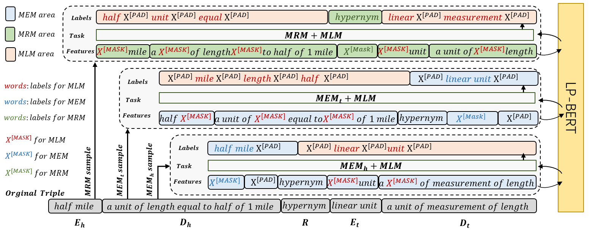

# LP-BERT: Multi-task Pre-training Knowledge Graph BERT for Link Prediction
This repository provides evaluation codes of LP-BERT for  link prediction task. The idea of PLNLP is described in the following article:
>**LP-BERT: Multi-task Pre-training Knowledge Graph BERT for Link Prediction (https://arxiv.org/pdf/xx.pdf)**

Only with BERT-base level parameters, LP-BERT achieves **top-1** performance on both WN18RR and UMLS datasets.

## Environment
The code is implemented with PyTorch. Requirments:  
&emsp;1. python=3.7  
&emsp;2. pytorch=1.9.0+cu102  
&emsp;3. transformers=4.2.1  
&emsp;4. numpy=1.17.2  
&emsp;5. pandas=0.25.1  
&emsp;6. sklearn=0.21.3  
&emsp;6. tqdm=4.52.0

## Reproduction of performance on WN18RR, UMLS and FB15k-237

### prepare data:

    python make_concat_data.py

### UMLS:

    CUDA_VISIBLE_DEVICES=0,1,2,3 python run_umls_pretrain.py
    CUDA_VISIBLE_DEVICES=0 python run_umls_finetune.py

### WN18RR:  

    CUDA_VISIBLE_DEVICES=0,1,2 python run_wn18rr_pretrain.py
    CUDA_VISIBLE_DEVICES=0 python run_wn18rr_finetune.py

### FB15k-237:  

    CUDA_VISIBLE_DEVICES=0,1,2 python run_fb15k237_pretrain.py
    CUDA_VISIBLE_DEVICES=0 python run_fb15k237_finetune.py
